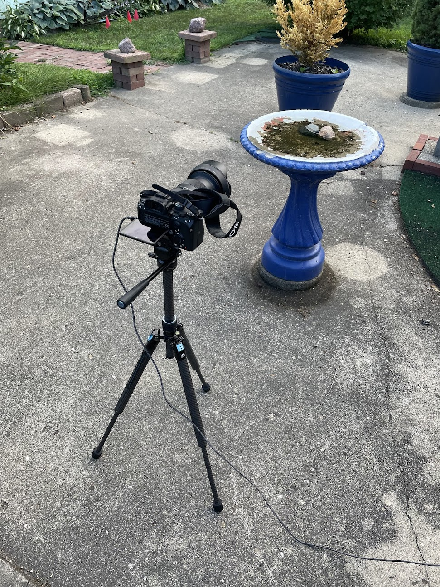
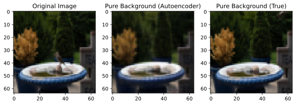
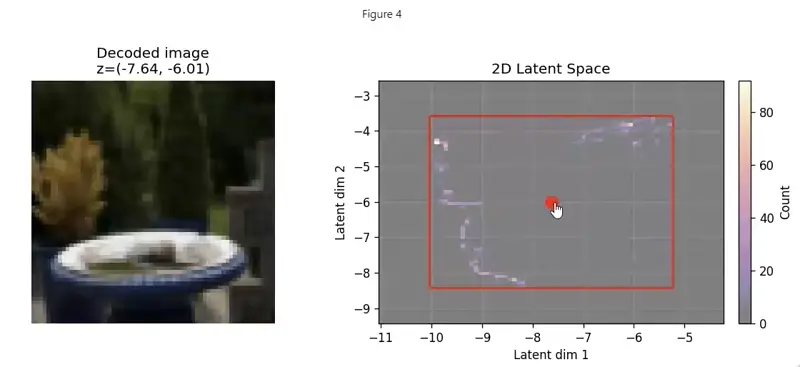
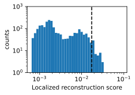
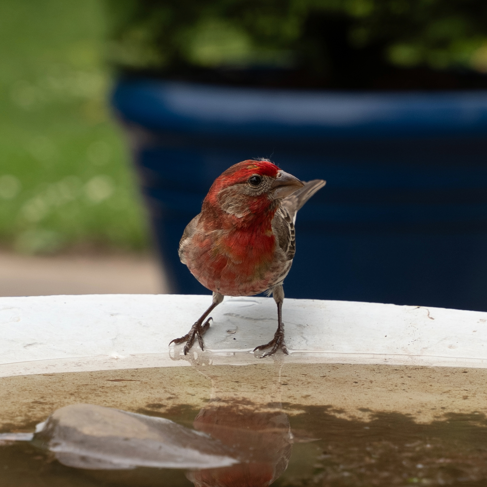
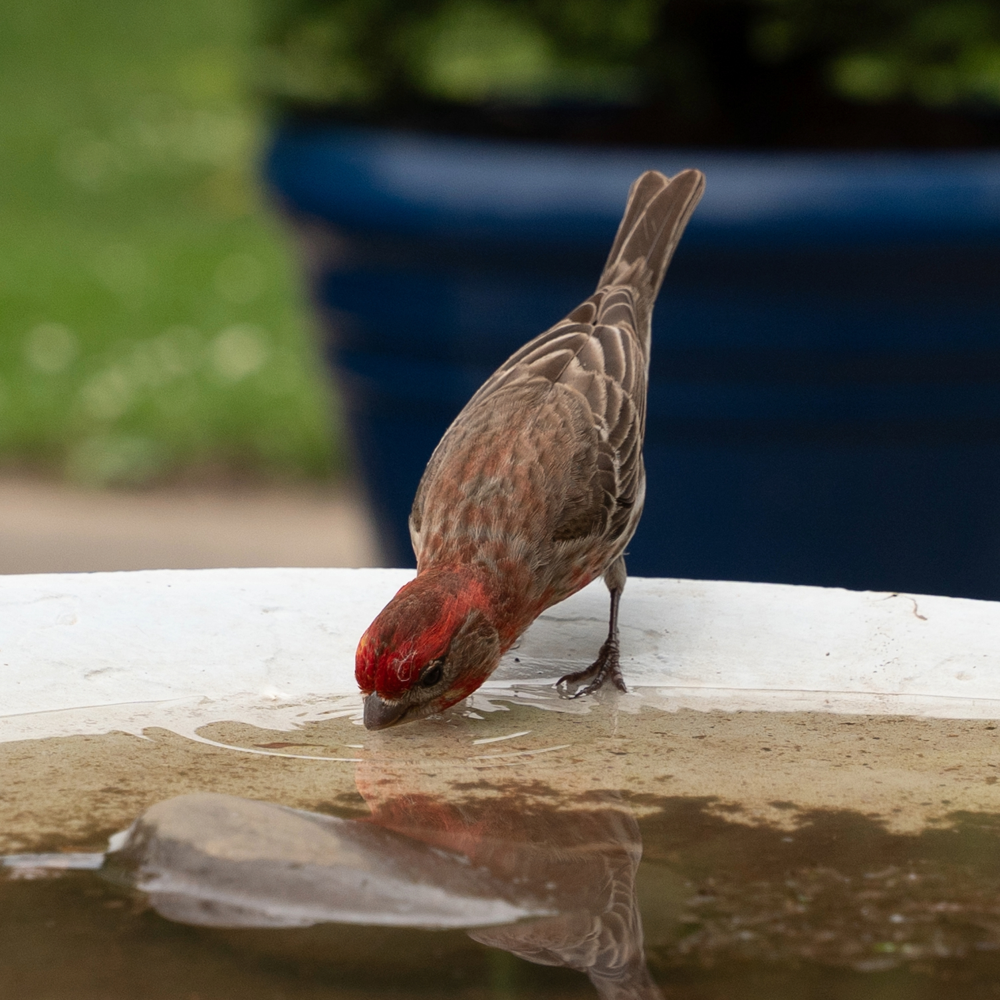

>This blog post has an accompanying [iPython notebook](https://github.com/rayhagimoto/bird-watching/blob/main/notebooks/autoencoder/bird_detection_with_convae.ipynb).



Recently I went to visit my Mum and I was amazed at the amount of wildlife that visits the backyard. 
Here's a sample of a few critters that I've managed to photograph which includes a groundhog, a deer, some birds, and a bee:


One morning my mum mentioned to me that there's a particular bird that she sees occasionally which she'd like to get a close-up of to identify it, so I figured that since I have a camera and a tripod I would give it a shot.
I decided my best bet was to point my camera at one of the bird baths we have in the backyard and set it to take pictures periodically for a few hours and check the results. 

I had considered building a motion-activated remote control system but I found that using an external device to control my camera was too unstable over WiFi or USB so I figured it was just easier to have the camera take pictures every 2 seconds and review the camera roll after.

One photo every 2 seconds is 1,800 photos an hour -- most of which (about 97.5%) are beautifully sharp images of an empty bird bath, e.g. 

Rapidly flicking through the images is only marginally more interesting than watching paint dry because you at least get to see the ambient light changing and the leaves rustling, but even so, after flicking through the first 300 photos hoping to spot a bird, I found nothing interesting.
I realized that I didn't want to spend the rest of my life holding my pinky down on the right arrow key and praying I didn't miss a bird, so I decided to automate the process. 

## Initial thoughts

Initially my goal was to simply build a computer vision model to locally identify which photos contained birds and which ones didn't, but I quickly became more ambitious.
For one thing, when I leave my camera outside to take pictures I have to wait for the timelapse session to end before I can review the pictures and find out if I captured any pictures of birds, which simply isn't good enough.
I wanted LIVE updates of bird-images to see the birds in real time.
As an example, here's what the notifications look like on my phone:



Rather than describing the different things I tried I'll start by discussing what I ended up building, pointing out the rationale behind some of the design choices. 
I ended up building two computer vision systems.

### Project Constraints and Budget

Before diving into the technical details, I should mention the constraints I set for this project:

**Hardware Constraints:**
1. I can only use existing hardware that I have (my camera, my tripod, my old Android phone)

**Budget Constraints:**
2. Spend as little money as possible

**Outcomes:**
- I spent $3.49 on the Tasker app (for Android automation)
- AWS Lambda has a generous free tier!
- AWS S3 also has a generous free tier, so I didn't spend any money here

These constraints actually forced me to be more creative with my solution. 
Instead of buying specialized wildlife cameras or motion sensors, I had to work with what I had and leverage cloud services that offer free tiers for small-scale projects like this. 

## Convolutional Autoencoder (offline, no alert system, more reliable)

The most reliable system I came up with to _quickly_ and _accurately_ detect anomalous (bird) images is a convolutional autoencoder. 
The basic idea is to imagine we have a black box which could take any image and convert it to a "pure background". 
For example, if the input image is a pure background, it is just the identity transformation.
However, if the input image contains a bird, it would return the same image with the bird removed (like using generative fill in Photoshop).
I figured that since birds show up so infrequently (less than 3% of the images), I could train an autoencoder on the entire image dataset (including the anomalous images). 
Here's an example of how it works on a picture that contains a bird:

I found that a convolutional autoencoder with 57,037 tunable parameters was sufficiently good at doing background reconstruction that I was able to achieve a false positive rate of ~10% and a false negative rate of 0%.

### Autoencoder anomaly detection pipeline in more detail

To explain the pipeline in a bit more detail. Here's what I did:

1. **Train the autoencoder on background patterns**: I split my dataset into 60% for training and 10% for validation, using approximately 2,800 images total (out of 4,000). The training takes about 4 minutes on my GPU. I used a log-MSE loss function, which applies a logarithmic transformation to the mean squared error between the original and reconstructed images. I found that whether I used a log-MSE or MSE I got similar performance, so the log-MSE choice is more because I tried it out and was too lazy to change it back after I found it performed the same.

2. **Compute localized anomaly scores**: For each image, I calculate a specialized "localized reconstruction score", which is different from the training loss. While the training loss measures global reconstruction quality across the entire image, this score is designed to identify local clusters of large differences. Here's how it works: First, I compute the pixel-wise difference between the original image and the autoencoder's reconstruction. Then I apply Gaussian smoothing to reduce noise and make local peaks more prominent. Next, I progressively downsample this smoothed difference map using max pooling until it reaches 4×4 resolution, keeping only the maximum value in each region. Finally, I take the highest value from this 4×4 map as the anomaly score. This approach is much better at detecting localized anomalies (like birds) than global metrics because it focuses on the most significant local reconstruction errors rather than averaging across the entire image. This step takes about 10 seconds.

3. **Determine the anomaly threshold using Otsu's method**: After computing scores for all images in the training and validation sets, I use [Otsu's method](https://en.wikipedia.org/wiki/Otsu%27s_method) to automatically determine the optimal threshold for separating normal from anomalous images. This method finds the threshold that maximizes the separation between two classes by analyzing the histogram of scores. It's much more reliable than manually setting a threshold and adapts automatically to the specific characteristics of your dataset. This step is almost instant (~5 milliseconds).

4. **Apply the threshold to find anomalies**: With the threshold determined, I can now classify any image as anomalous if its score exceeds this threshold. Since I've already computed scores for all images, this classification step is nearly instantaneous ~5 milliseconds. The final output is a list of filenames corresponding to images that likely contain birds.

### What did the autoencoder learn? 

This was probably my favourite part of the project.
I wanted to visualize how the decoder was mapping from the 2D latent space to images so I created an interactive figure with two axes (shown below).
On the right is a depiction of the latent space, with a 2D heatmap highlighting points in the latent space where my images were mapped to. 
The histogram is bounded by a red box, outside which none of the images in my dataset were mapped to. 
(So as far as the decoder is concerned, it's the Wild West). 
On the left is the image computed by feeding the latent space point through my decoder. 
By clicking different points in the latent space I was very satisfied to find that the autoencoder had indeed learned many different lighting configurations of the bird bath background. 
In the animation below you can see me clicking and dragging the red dot to visualize different parts of the latent space. 
As the red dot moves around you can see the decoder smoothly interpolating between different angles of sunlight, with different intensities. 
The smooth interpolation is particularly compelling. 
Moreover, I noticed that even when I took the red dot out of the bounding box (especially in the far bottom-left region) the decoded image still looks like a reasonable extrapolation.

  <figure>
    
    <figcaption class="text-center text-sm text-neutral-500 mt-2">Interactive visualization of the autoencoder's latent space</figcaption>
  </figure>

### Why are false positives happening?

There are some instances when a picture will have a localized reconstruction score that exceeds the threshold set by Otsu's method. 
Before I explain Otsu's method in a bit more detail it's instructive to look at the distribution of scores to see _why_ Otsu's method might be suited to this problem.
Below is a histogram of the reconstruction scores on a log-log scale. 
Notice that this distribution is clearly bimodal, with a clear separation between the background class (left) and the anomaly class (right) -- this is one of the benefits of choosing a localized difference score; I found that when I experimented with a global difference score the distributions had far more overlap.

  

Otu's method systematically scans different thresholds for the binary classification e.g. 

$$
  \begin{align*}
    \mathrm{score} > \mathrm{threshold} \Rightarrow \mathrm{anomaly}
  \end{align*}
$$

 and chooses the threshold which minimizes the weighted averaged of intra-class variances for the background and anomaly classes respectively (where the weights are given by the class probabilities).

The plot above shows that the threshold computed using Otsu's method (black dashed line) is in the far right tail of the distribution of background scores, but not quite in the empty space between the two distributions. 
I think this is actually ideal because I want my anomaly detector to have as few false negatives as possible, and that means having a higher tolerance for false positives.
I'm okay with seeing a few background images because it doesn't take long to manually filter them out.
On the other hand, false negatives could mean missing out on the photo of a life time!

Still, I was curious about why some background images have a reconstruction score about 3 times higher than the modal score.

  <figure>
    
    <figcaption class="text-center text-sm text-neutral-400 mt-2">False positives typically occur at transitions between two drastically different lighting conditions.</figcaption>
  </figure>

This figure demonstrates a classic false positive case. On the left is a still image of what appears to be just the background - no bird in sight - yet it was flagged as an anomaly by the autoencoder. When I investigated this particular image, I looked at the photos taken immediately before and after it and discovered that this image was captured during a sudden transition between two distinct lighting conditions. Perhaps a cloud had parted briefly, allowing direct sunlight to hit the bird bath for just a moment, or maybe the sun emerged from behind a tree. The autoencoder, having been trained primarily on more stable lighting conditions, struggled to reconstruct this transitional state and flagged it as anomalous.

The right side of the figure shows an animation that sequences through the images before, during, and after this lighting transition. The animation pauses when it reaches the problematic image (indicated by the play button overlay) so you can see exactly when in the sequence the false positive occurred. This visualization helps explain why the autoencoder was confused - the sudden change in lighting created a pattern it hadn't seen enough of during training.

## Real-time system

The goal of the real-time system is to enable my phone to receive alerts when my camera has taken pictures of a bird within seconds of the picture being taken, and without me having to go outside and interrupt the timelapse.

 In order to get this to work I had to use a different computer vision model which is more lightweight than the PyTorch Autoencoder.
 The resulting model is less reliable but it's fast enough to work in real-time on AWS Lambda, even accounting for cold starts. 
 In my stress testing I found that it can handle the fastest setting for my camera's timelapse interval which is 1 photo per second. 

Below is a picture of the physical set up: my camera on a tripod, pointing at the bird bath, with a USB-C cable connecting it to my phone.
The phone is then able to handle HTTP requests and communicate with my cloud-deployed computer vision model.

To be more precise, the way it works is that I connect my camera to my phone via USB-C and have my camera write two files (i) a raw (24 MP `.ARW` files) saved to an internal SD card and (ii) a low quality (2-7 MB) `.jpg` to my Phone's storage.

Here's how the cloud pipeline works:

1. **Dual file capture**: My camera simultaneously saves high-quality raw files (24 MP `.ARW`) to an internal SD card and lower-quality JPEGs (2-7 MB) to my phone's storage via USB-C connection.

2. **File detection**: On my phone, I use the Tasker app to monitor for new `.jpg` file creation events in my `Pictures` folder.

3. **Secure upload preparation**: When a new image is detected, Tasker triggers an HTTP request to my AWS Lambda function, which generates a pre-signed URL for secure S3 upload without requiring AWS credentials on my phone.

4. **Cloud upload**: The pre-signed URL allows temporary upload permissions to my S3 bucket, where the image is stored securely.

5. **Automated analysis**: S3 bucket events trigger my computer vision Lambda function to analyze the uploaded image using the background subtraction algorithm.

6. **Real-time notification**: If an anomaly (hopefully a bird) is detected, the system sends the image to my Telegram account via a bot I configured.

The system is designed to handle images uploaded once per second (the maximum rate my camera can achieve) and can process them efficiently even with AWS Lambda cold starts.

### Computer vision model

This technique also uses a form of background subtraction, but instead of using an autoencoder to produce pure background images, it uses an exponential moving average of the photos over the last 30 seconds.
I found 30 seconds to be a good time frame because it prevents false positives from being caused by gradual changes in lighting.

Here's how the real-time detection works:

1. **Background modeling**: For each new image, I update an exponential moving average (EMA) of the background using a decay factor of 0.05. This creates a smooth, adaptive background model that gradually adapts to lighting changes.

2. **Luminance comparison**: I convert both the current image and background model to grayscale using standard luminance coefficients (0.2126×R + 0.7152×G + 0.0722×B), then compute the absolute difference between them.

3. **Noise reduction and thresholding**: I apply Gaussian blur to the difference map to reduce noise, then threshold it to create a binary map highlighting regions with significant differences from the background.

4. **Contour analysis**: I find contours in the binary map and filter them based on several criteria: area (between 0.15% and 5% of image), aspect ratio (max 2:1), vertical position (preferring middle 70% of image), and contrast (minimum 10 gray levels).

5. **Scoring and detection**: Each valid contour is scored based on its area and the mean squared luminance difference within the contour. The highest-scoring contour above a minimum threshold triggers an anomaly detection.

The system requires at least 10 observations before making predictions to ensure the background model has stabilized. This approach is much faster than neural networks and can run efficiently on AWS Lambda with cold starts.

## Success!

Anyways, after all this I eventually got lucky and snapped a picture of the bird my Mum was curious about. 
Turns out it is a male House finch!


  
  


Here are some more images to enjoy

