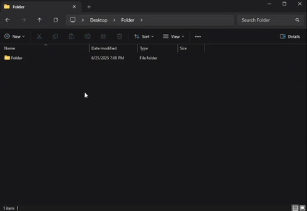
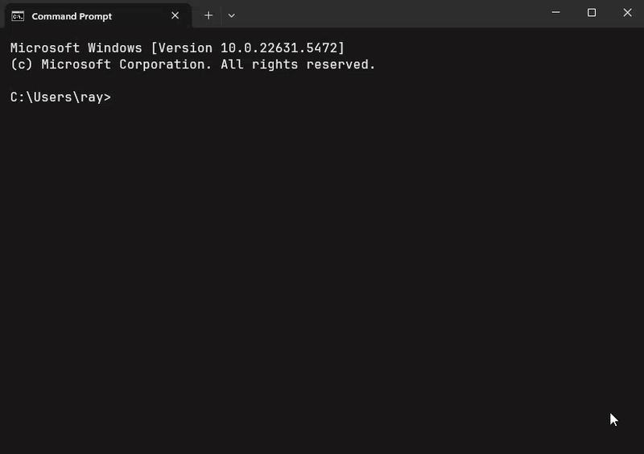

+++
date = '2025-06-20T12:03:29-05:00'
draft = false
title = 'Creating a WSL Context Menu in Windows 11'
+++



# How to add an Open WSL here context menu in Windows 11

In this blog post I will explain how I added an 'Open WSL here' context menu in Windows 11.

<div class="max-w-[20rem] mx-auto">

</div>

This solution opens Windows Terminal with the correct terminal profile so that the tab uses the Ubuntu icon and tab name.



# TL;DR Solution:

1. **Find your wt.exe path**

   ```powershell
   (Get-Command wt.exe).Source
   ```

   For me it returned something like:

   ```text
   C:\Users\ray\AppData\Local\Microsoft\WindowsApps\wt.exe
   ```

2. **Create the per-user registry key**

   1. Open **Regedit**.
   2. Go to (or create) these keys under your user hive (HKEY_CURRENT_USER):

      ```text
      HKEY_CURRENT_USER\Software\Classes\Directory\Background\shell\WSL
      ```
   3. Under `WSL`, make a **command** sub-key.
   4. Select **command**, double-click **(Default)**, and set it to:

      ```text
      "C:\Users\ray\AppData\Local\Microsoft\WindowsApps\wt.exe" -p "Ubuntu 24.04.1 LTS" -d %V
      ```
   5. Close Regedit, then restart Explorer or log out and back in.

3. **Get WSL Profile name**

   1. Open Windows Terminal in Powershell or Command Prompt
   2. Run `wsl --list`
   3. Identify the profile you want to use (for me it's Ubuntu-24.04)
   
   4. Write it down or remember it.

4. **Update Ubuntu Profile "Command Line" Setting**

   1. Open Windows Terminal.
   2. Go to the settings panel (CTRL + ,) or Dropdown Menu -> Settings.
   
   3. Click on the dropdown arrow next to "Command line".
   4. Change it from whatever it currently is to 
      ```
      C:\Windows\system32\wsl.exe -d <NAME_FROM_STEP_3>
      ```
      (For me it was `C:\Windows\system32\wsl.exe -d Ubuntu-24.04`).

5. **Update "Starting Directory" Setting**

   1. Right underneath the "Command line" option we just set, you will see "Starting directory". If you don't do this then when you open WSL in a new tab from Windows terminal it'll always start in `system32/` .
   2. Change the "Starting directory" option to "~".  
      I was worried that this would break some WSL behaviors like inheriting the directory from the process that launches it but so far I haven't run into any undesired behavior. Things I've tested: Opening WSL from Powershell opens WSL at whatever directory Powershell was in; opening WSL using the "Open WSL Here" context menu option opens WSL at that directory. 

5. **(Optional) Add an icon**

   1. Navigate to the same key we in we used in step 2.2:

      ```text
      HKEY_CURRENT_USER\Software\Classes\Directory\Background\shell\WSL
      ```
   2. Right-click the right panel -> New -> String Value
   3. Name it "Icon"
   4. Right-click on "Icon" and select "Modify"
   5. Enter the path to your desired `.ico`. 
      E.g. I made a directory at `C:\Users\<USERNAME>\WindowsTerminalIcons` containing a file called `ubuntu.ico` which I generated by finding a .png of the Ubuntu logo and then finding a png to ico converter online. So I entered `C:\Users\<USERNAME>\WindowsTerminalIcons\ubuntu.ico`.

---

# Things I tried / common pitfalls

## Environment details

To give some context: I'm on **Windows 11**, and I installed **Windows Terminal from the Microsoft Store**. That means `wt.exe` is really just an alias for:

```text
C:\Users\<you>\AppData\Local\Microsoft\WindowsApps\wt.exe
```

If I had installed Windows Terminal by downloading the executable installer the traditional way from the [Microsoft website](https://apps.microsoft.com/detail/9n0dx20hk701?hl=en-US&gl=US), I'd have a real binary at `C:\Program Files\Windows Terminal\wt.exe` and none of the alias drama below would have been an issue.

**Tip:** Before beginning, check if you can open Windows Terminal by pressing **Win + R**, typing `wt.exe`, and hitting Enter. If it opens you don't need to provide the full path to the `wt.exe` executable when you write your registry key command, unlike me.

## Why I worked under HKEY_CURRENT_USER instead of HKEY_CLASSES_ROOT

I first tried editing the key I found in the screenshot under:

```text
HKEY_CLASSES_ROOT\Directory\Background\shell\WSL\command
```

But I got an "access denied" message. By consulting ChatGPT, I learned that anything I put under:

```text
HKEY_CURRENT_USER\Software\Classes\Directory\Background\shell\WSL
```

would override the global settings in `HKEY_CLASSES_ROOT`. And since that HKEY_CURRENT_USER path belongs to me, I could edit it without admin rights.

## Picking the right placeholder: `%V` vs `%1`

When Explorer runs my command, it replaces:

* **`%V`** → the folder path when I right-click the **background** of a folder window
* **`%1`** → the path when I right-click the **folder icon** itself

I wanted the menu item on the empty space (background), so I used `%V` to pass the directory path into my `wt.exe` call.

## The console host vs Windows Terminal

My first working command was:

```text
wsl.exe -d Ubuntu-24.04 --cd "%V"
```

That dropped me into Ubuntu-24.04 correctly, but in the old console host, so the tab title and icon as the command prompt's, which looks ugly and that really bothered me.
This behaviour is due to the fact that the command is being run from command prompt when you run `wsl`. Here's an example of what happens when you open WSL from Powershell, showing the same behaviour (notice that the tab name and icon stay as the powershell tab name and icon)


Next, I changed it to:

```text
wt.exe -p "Ubuntu 24.04.1 LTS" -d "%V"
```

From PowerShell or cmd, that launched Windows Terminal with the right tab title. But when I clicked the context menu entry, nothing happened. No error, no window—just silence. This confirmed that the Store alias `wt.exe` wasn't resolving in Explorer.

### Quick experiments

* **`cmd.exe /c start "" wt ...`** worked but flashed a brief cmd window.
* **Direct `wt.exe`** worked in shells but hung or failed in Explorer and Run.
* **Using the real binary path** fixed everything—no flashes, no hangs.

## Final fix: use the real WT binary

I ran `(Get-Command wt.exe).Source` to get the full path to the real EXE, then updated my HKEY_CURRENT_USER registry entry to:

```text
"C:\Users\ray\AppData\Local\Microsoft\WindowsApps\wt.exe" -p "Ubuntu 24.04.1 LTS" -d "%V"
```

After restarting Explorer, Shift + Right-Click on any folder background and choosing **Open WSL here** fires up Windows Terminal directly into Ubuntu-24.04, with the proper tab title and no extra console windows, but at the wrong directory! I found that by changing the "command line" setting from `ubuntu2404.exe` to `C:\Windows\system32\wsl.exe -d Ubuntu-24.04` I could solve the issue. I guess the problem is with accessing the `ubuntu2404.exe` executable directly instead of going through `wsl.exe` as a middle-man.

---

**Summary highlights:**

* Check your alias: **Win + R → `wt.exe`**
* Override global registry by editing **HKEY_CURRENT_USER\Software\Classes**
* Use `%V` for background clicks
* Find the real `wt.exe` path with `(Get-Command wt.exe).Source`
* Point your context-menu command at that full path for a clean launch
* Change 'command line' option from your Linux executable to `C:\Windows\system32\wsl.exe -d ProfileName`
