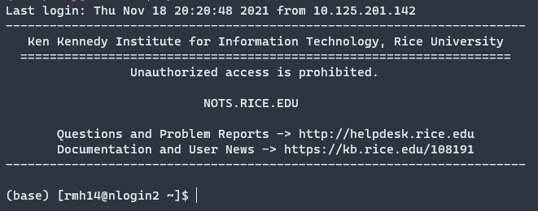
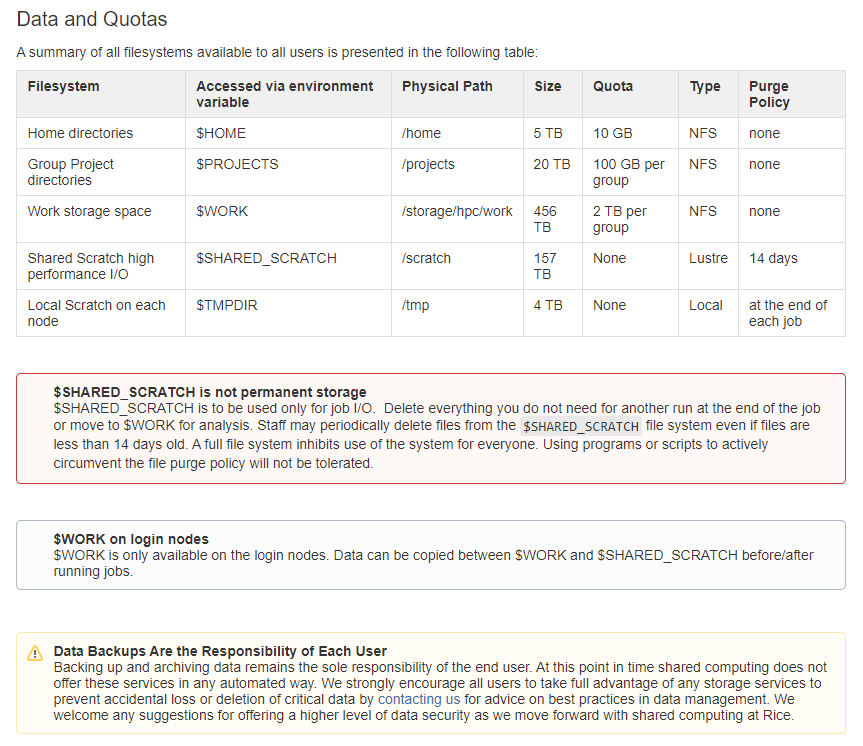
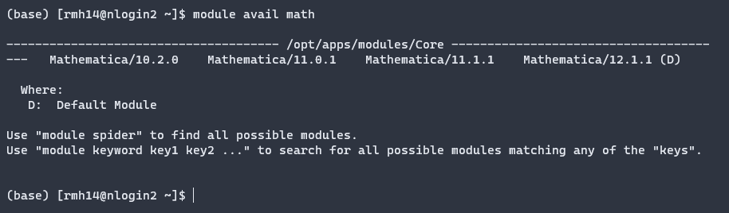

Useful link: <https://kb.rice.edu/page.php?id=108237>

# Connect to NOTS via SSH.

If on campus, or at RGA/RVA, connect to "Rice Owls" network. (You can't connect to NOTS if you're on "Rice Visitor".) If off-campus, [follow these instructions](https://kb.rice.edu/108238) to set up the Rice VPN. Then, SSH into NOTS by opening up a  terminal and typing

```
ssh -Y [your NetID, e.g. abc123]@nots.rice.edu
```

Type in the same password you use to log in to ESTHER. You should now be connected to one of the login nodes.



# Overview of Filestructure


(screenshot from <https://kb.rice.edu/page.php?id=108237>)

After SSH-ing into a login node your terminal will be in your local user directory `/home/[your NetID]/` e.g. `/home/abc123/`. You can freely edit anything in this directory. 

`cd` into `$SHARED_SCRATCH` and `mkdir` a directory for yourself:

```
cd $SHARED_SCRATCH
mkdir [your NetID]
```

The `$SHARED_SCRATCH` directory is a place to store *temporary* files for job i/o. Files here may be purged after 14 days. Once a job is done, you will copy the output to your directory in `$WORK`. First `cd` into `$WORK/[your advisor's NetID]` and `mkdir [your NetID].` For me I had to write

```
cd $WORK/al72
mkdir rmh14
```

# Modules

`module avail` gives a list of available modules. Adding a keyword afterword, e.g. 

```
module avail math
```

returns a list of modules with the word "math" in them:



# Interactive session:

```
srun -p=interactive --pty --export=ALL -n=1 -c=1 --time=00:30:00 /bin/bash
```

See <https://slurm.schedmd.com/srun.html> for explanation of the options. There is a time limit of 30 minutes; if you request 1 hour of time you will receive an error.

Check how many resources previous jobs have used with ```sacct --format="JobID,CPUTime,MaxRSS"```