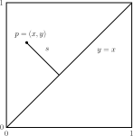



I have started looking into quant interview questions again and I went down a rabbit hole with one I found on [quantable.io](https://quantable.io).

It goes like this:

> Suppose you draw points \\(p = (x,y)\\) uniformly at random from the unit square.
> What is the expected value of the distance \\(s\\) of the sampled point \\(p\\) from the line \\(y = x\\)?
> 

The solution to this question is relatively straightforward. 
First, due to symmetry we can limit ourselves to thinking about one of the triangles formed by dividing the square with the line \\(y = x\\).
Next, take the diagonal as the 'base' of the triangle. 
What we are looking for is the average distance from the base to any point in the triangle.
We can express this as an integral,
$$
  \bar{y} = \frac{1}{A} \int \int_A y \mathrm{d}A ,
$$
where \\(A\\) denotes the area of the triangle. 
There are many ways to evaluate this integral (you could use Green's theorem, choose coordinate systems that simplify the calculation, etc.) but on my first pass I brute-forced it.
First, the area \\(A\\) is just half the area of the unit square, so \\(A = 1/2\\).
Thus,
$$
  \bar{y} = 2 \int_0^{1 / \sqrt{2}} \int_y^{\sqrt{2} - y} y \, \mathrm{d}x \mathrm{d}y = \frac{1}{3\sqrt{2}} ,
$$
and we're done.

Although it was relatively straightforward to get the answer, this problem made me ask several more questions. 
First of all, why is the answer exactly \\(1/3\\) of the height of the triangle? 
Its simplicity hints that there is an easier way to do the problem.
Secondly, the same day that I solved this problem an undergrad asked me to help them with a problem that required using the rotational version of Newton's second law (with torques), and that reminded me that the expectation value we calculated here can be recast as a balancing problem in physics. 

This was some of the motivation for me to write [these notes on centroids](/notes/geometry/centroids.pdf).

When I was trying to explain the solution to the student several more things stuck out to me.
For one, I wanted to convince them that when we solve problems involving torque, the \\(\vec{r}\\) we use in \\(\vec{r} \times \vec{F}\\) can be taken to be measured from an _arbitrary_ point, so long as we use the same \\(\vec{r}\\) to calculate the other torques.
Another thought I had was that it would be nice to explain why we define torques ("rotational force") as \\(\vec{r} \times \vec{F}\\), and not, say \\(r^{2.31} \vec{r} \times \vec{F}\\).
The best answer I could come up with was because of symmetries and Noether's theorem: if we suppose physics is symmetric under \\(SO(3)\\) rotations, we get a corresponding conserved quantity -- angular momentum. 
Then, we define torque as the thing that causes time-varying changes in angular momentum -- \\(\vec{\tau} = \frac{\mathrm{d} \vec{L}}{\mathrm{d} t}\\).
Using \\(\vec{L} = \vec{r} \times \vec{p}\\), Newton's second law \\(\vec{F} = \frac{\mathrm{d} \vec{p}}{\mathrm{d}t}\\), and taking \\(\vec{r} = \mathrm{const}\\), we immediately get the usual expression for torque \\(\vec{\tau} = \vec{r} \times \vec{F}\\).

